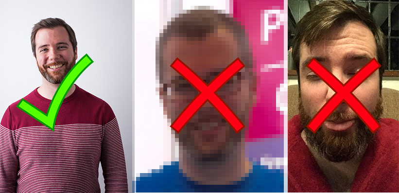

## Find an image

To begin, you will need to find two images: an image of a celebrity or person with the hairstyle you want to use in your project, and an image of the person you want to give the hairstyle to.

When you are looking for an image, you need to think about:

- How large the image is — images that are too small will not look good
- Whether you have **permission** to use the image

For example, here you can see three images. The image on the far left is clear, and the subject was obviously aware that the photo was being taken. The centre image is of a low quality and heavily pixelated. The image on the right was taken without the subject being aware that he was being photographed, and he would probably not consent to it's use.

+ A good place to look for pictures online is [Wikimedia Commons](https://commons.wikimedia.org/wiki/Main_Page){:target="_blank"}, where there are lots of images available under a Creative Commons license.  

[[[images-permissions-to-use]]]
