## Edit the hair

For now, we will use this image from [Wikimedia Commons](https://commons.wikimedia.org/wiki/File:Quiff_hairstyle_-_01.jpg){:target="_blank"}:

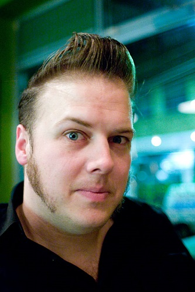

This image has a [CC-BY-3.0 license](https://creativecommons.org/licenses/by/3.0/deed.en){:target="_blank"}, which means we can use, alter, and share the photo as long as we credit the original person who took the photo. You can credit the person simply by adding their name and a link to the license where you share the image, like this:

_By Tim Lucas [CC BY 3.0](http://creativecommons.org/licenses/by/3.0){:target="_blank"}, via Wikimedia Commons_

+ Choose your two images, one containing a hairstyle and the other a photo of the person you would like to put the hairstyle onto. Save the images into a folder on your computer.

+ Open up [Pixlr](https://pixlr.com/editor/){:target="_blank"}, which is a free online image editor. If you have access to another image editing tool that you prefer, you can use that instead.

+ Select **Open image from computer** or **Open image from URL**  from the menu, and select the image containing the hair style you wish to use, or copy in the url of the image you want to use..

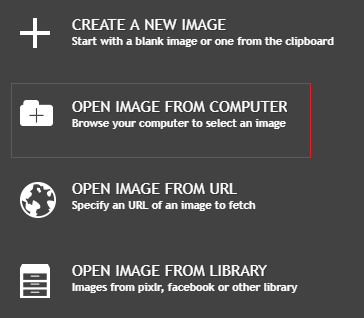

+ Using the **lasso** tool, draw a rough outline around the person's hair. It doesn't matter at this stage if you also get some skin or some of the background — we will remove that in a minute.

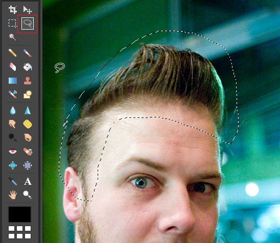

+ Press <kbd>Ctrl + C</kbd> to copy the hair.

+ Click **File** > **New image**, and click **OK** on the box that pops up.

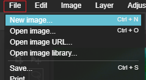

+ Press <kbd>Ctrl + V</kbd> to paste the hair into the new image.

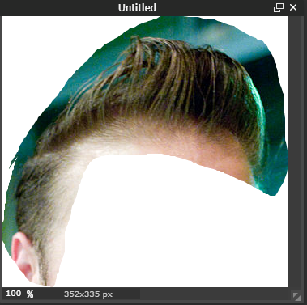

+ Now you need to remove the background. In the layers palette on the right, double-click on the padlock next to the **Background** layer. This will unlock that layer.

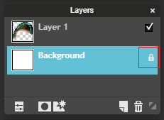

+ To remove this layer, press the key on your keyboard marked <kbd>Delete</kbd> (NOT the backspace key), or go to **Edit** > **Clear** on the menu. The background of the image will change to a checkerboard pattern, which means that the area is transparent.

Let's tidy up the messy bits of background around the hair.

+ Switch back to Layer 1 by clicking on it in the layers palette.

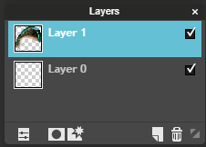

+ Select the magic wand tool from the tools palette.

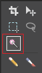

+ Click on part of the green background you want to remove. It will become highlighted with a wiggly line around the edge. You can now press the <kbd>Delete</kbd> key to remove it.

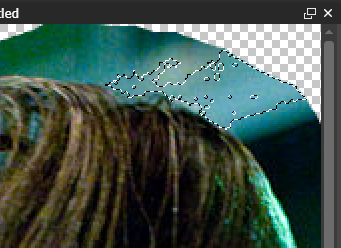

+ To make your magic wand select more of the green background, you can change its **tolerance** setting. A low tolerance means that the wand will only select areas of colour that are very similar to the colour you clicked on. The higher the tolerance, the less strict the wand's selection. Tolerance ranges from 0 to 255.

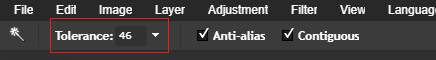

+ Remove as much of the background and the skin as you can, taking care not to delete any of the hair. You will be left with a few annoying bits hanging around.

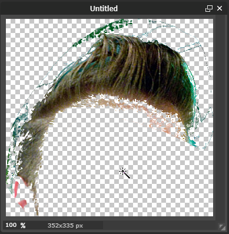

+ Press <kbd>Ctrl + D</kbd> to deselect any areas that might still be selected by the magic wand. You want nothing to be selected, so check that you see no wiggly lines anywhere on the image.

+ Select the eraser tool and carefully remove any leftover areas around the hair that the magic wand missed. To make it easier to remove the small bits, you can change the size and shape of your eraser by clicking on the **Brush**.

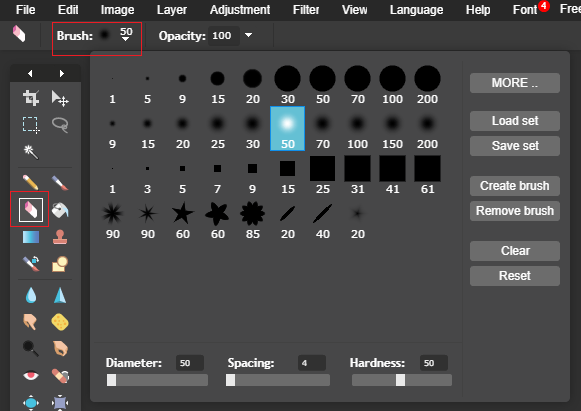

+ Once you are satisfied, click **File** > **Save**. In the box that appears, give your file a name. Make sure you select **PNG** as the file type so that your image will be saved with a transparent background.

+ You should now have a finished hairstyle with a transparent background.

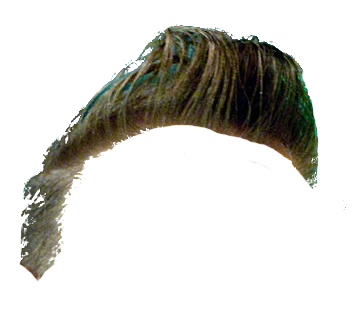
