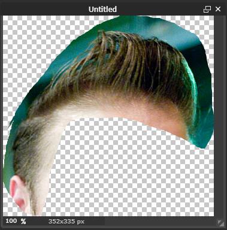

## Edit the hair

For this resource, we will use this image from [Wikimedia Commons](https://commons.wikimedia.org/wiki/File:Quiff_hairstyle_-_01.jpg){:target="_blank"}.

This image has a [CC-BY-3.0 license](https://creativecommons.org/licenses/by/3.0/deed.en){:target="_blank"} which means we can use, alter and share the photo as long as we give the original person who took the photo credit. You can credit the person simply by putting their name and a link to the license, like this:

_By Tim Lucas [CC BY 3.0](http://creativecommons.org/licenses/by/3.0){:target="_blank"}, via Wikimedia Commons_

+ Open up [Pixlr](https://pixlr.com/editor/) which is a free online image editor. If you have access to another image editing tool (e.g. Photoshop) that you prefer, you can use that instead.

+ Select "Open image from computer" from the menu and open up the image containing the hair style you wish to use.

+ Using the **lasso** tool, draw really roughly around the person's hair. It doesn't matter at this stage if you also get some skin or some of the background, we will remove that in a minute.

+ Press <kbd>Ctrl + C</kbd> to copy the hair

+ Click **File** > **New image** and press **OK** on the box that pops up.

+ Press <kbd>Ctrl + V</kbd> to paste the hair into the new image

+ Now you need to remove the background. Double click on the padlock next to the **Background** layer in the layers palette on the right to unlock that layer.

+ Press the key on your keyboard marked <kbd>Delete</kbd> (NOT the backspace key) or go to **Edit** > **Clear** on the menu. The background of the image will change to a checkerboard which means that area is transparent.

Let's tidy up the messy bits of background around the hair.

+ Switch back to layer 1 by clicking on it in the layers palette

+ Select the magic wand tool from the tools palette

+ Click on part of the green background you want to remove, and it will become highlighted with a wiggly line around the edge. You can now press the <kbd>Delete</kbd> key to remove it.

+ To make your magic wand select more of the green background, you can change the **tolerance**. A low tolerance means that the wand will only select areas of colour that are very similar to the colour you clicked on. The higher the tolerance, the less strict the wand is.

+ Remove as much of the background and the skin as you can, taking care not to delete any of the hair. You will be left with some annoying extra bits hanging around.

+ Select the eraser tool and carefully remove any leftover areas. You can change the size and shape of your eraser by clicking on the **Brush** to make it easier to remove the small bits.

+ When you are satisfied, click **File** > **Save**. In the box that appears, give your file a name. Make sure you select PNG as the type of file so that your image will be saved with a transparent background.

+ You should now have a finished hairstyle with a transparent background

