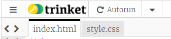
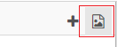
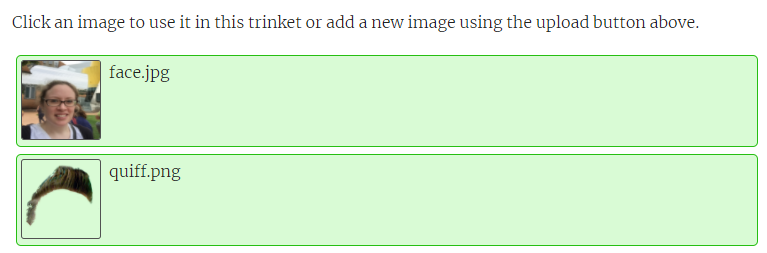
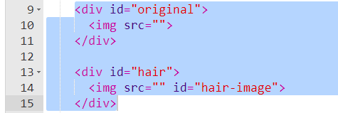
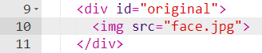
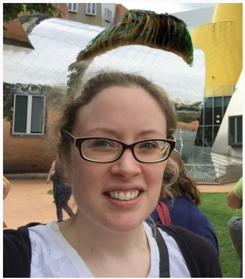

## Add the images

+ Open up the [starter trinket]() DO SHORT LINK here

You will see some HTML code inside `index.html` and some CSS code inside `style.css`.

+ Click on the image icon to the top right of the code area

+ Click **Add image**, then **Upload**, then **Click to select files**

+ Select the hair image you just made and the face you would like to add it to.

Wait for the images to upload, then make sure that both are selected in green so that you can use them in this trinket.

Make a note of the file names of the images - in this example we have `face.jpg` and `quiff.png`

I am using a photo of myself so that I know I have permission to use it, and I am happy for this photo to be seen in public on the internet.

+ Go back to `index.html` and look at the code on lines 9 to 15

Where you see the code `src=""` you need to add the name of the picture you want to display in between the quotes.

+ Add the file name of your face image between the quotes of the first image tag

+ In exactly the same way, add the file name of the hair image inside the second image tag

You should see both images appear in the area to the right of the code area, but they might not be positioned very well.

