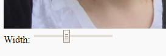

## Add a slider

Let's add a slider so that the person using your app can change the width of the hair to make it fit on the person's head properly.

+ Click on line 18 which is inside the div labelled `sliders`


+ Add the following code to add a width slider to your page - this will control the width of the hair image so we can fit it to the person's head.

```javascript
Width: <input type="range" min="1" max="300" value="50" id="hairwidth">
```
You should see the slider appear below your picture



If you move the slider at the moment, nothing happens. You need to write some code to tell the page "when this slider is moved, change the width of the hair".

+ Position your cursor between the `<script>` and `</script>` tags. This is where you can write **Javascript** code.

+ Create a variable called `width_slider` which refers to the slider you just added, like this:

```javascript
var width_slider = document.getElementById("hairwidth");
```

Notice that the ID of the slider you just created was `hairwidth` and this is how we are selecting it using `getElementById`.

+ Underneath this, but still within the `<script>` tags, add some code to change the width of the hair whenever the slider's value is changed:

```javascript
// When I move the width slider...
width_slider.oninput = function() {
  // Change the width of the hair
  document.getElementById("hair-image").style.width = this.value + "px";
}
```

This code says _"when the `width_slider` is moved, select the `hair-image` and set its `style.width` to the value of the slider (`this.value+"px"`)"_.

+ Move the slider and you should see the hair image get bigger or smaller as you drag it.


