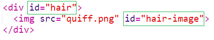
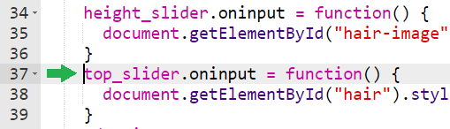
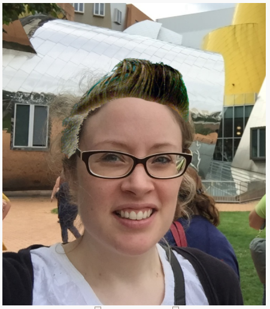

## Change the position

Now that you can change the width and height of the hair image, let's also make it possible to change its position so you can perch it perfectly on top of the head you picked out!

The process is almost the same as for the width and height of the hair, with only one small difference. When you changed the width and height of the hair, you were modifying the `` with the ID `hair-image`:



To move the hair around, you will need to modify the `<div>` with the ID `hair` instead. A `<div>` is an invisible box which can be moved around and positioned on the page.

+ Add code for a top slider below to the code for the other sliders — this will control how far from the top of the page the hair image is located.

```javascript
Top: <input type="range" min="1" max="300" value="50" id="hairtop">
```
+ Between the `<script>` and `</script>` tags, create a variable called `top_slider` to refer to the slider you just added:

```javascript
var top_slider = document.getElementById("hairtop");
```

+ Below this, but still within the `<script>` tags, add some code to change the distance from the top whenever the top slider's value is changed. This time we will select the `hair` element instead of the `hair-pic`.

```javascript
top_slider.oninput = function() {
  document.getElementById("hair").style.top = this.value + "px";
}
```

Take care to add this new code **after** the closing braces of your existing code, rather than inside them.



+ Move the slider. You should see the hair image move closer or further from the top of the page.

+ Add a `left` slider in exactly the same way: repeat the same steps but replace `top` with `left` each time it occurs to allow your hair to be positioned at variable distances from the left of the page.

+ Use the sliders to position and resize the hair so that it looks like it belongs to the person in the picture.



To save your picture, you can press the <kbd>Print screen</kbd> button (on a Windows computer) or <kbd>Command + Shift + 4</kbd> (on Mac), and then paste the image into your favourite image editor to crop and save.
