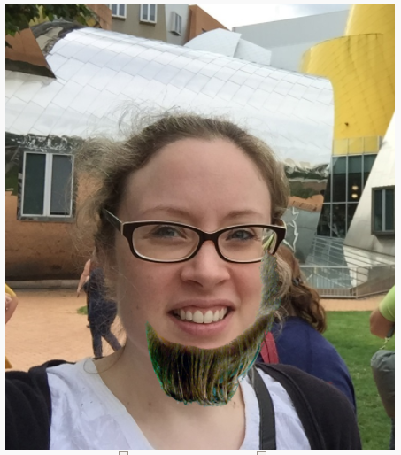

## Challenge: rotate the hair

+ Can you add a slider which allows you to rotate the hair `<div>`?

You can follow the same procedure you used to add the top and left sliders, but you will need a different command to tell the hair to rotate:

```javascript
document.getElementById("hair").style.transform = "rotate(" + this.value + "deg" +")";
```

Don't forget that the sliders currently have a minimum value of 1 and a maximum value of 300. How will you need to change this for your rotation slider to make the hair able to rotate in a full circle?

```javascript
Left: <input type="range" min="1" max="300" value="50" id="hairleft">
```

Now you can give the people in your pictures funny beards too!



+ Can you add more hair choices? Find another image and edit it to remove the background as you did for the hair, then add it to your trinket. Perhaps this time you could add a moustache or pigtails?
